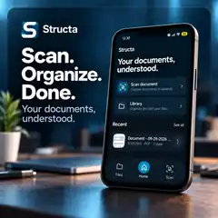
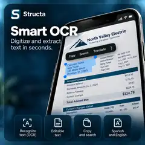
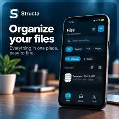
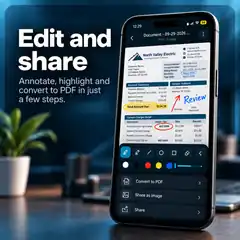

# Structa

### Scan. Organize. Done.

**Your documents, understood.**

**[Download Structa from GitHub Releases](https://github.com/de1t4s/Structa/releases/latest)**

> [!IMPORTANT]
> This is Structa's **official public distribution repository**. Source code, backend code, development configuration and debug material are maintained privately. Android builds are distributed through [GitHub Releases](https://github.com/de1t4s/Structa/releases).

## Your documents, understood

Structa is an Android document app built around a simple workflow: **scan, understand, organize and use your documents**.

Instead of treating scanning, OCR, file management, editing and document Q&A as unrelated tools, Structa brings them together in one app.

  

## Smart OCR

**Turn scanned documents and images into usable text.**

Structa uses OCR (Optical Character Recognition) to detect text inside documents. Recognized text can be selected and used for actions such as copying and searching, making paper documents far easier to work with digitally.

  

## Organize your files

**Keep your documents in one place and find them when you need them.**

The Structa library is designed around quick access to documents, folders and common file types. Search and filters help keep scanned documents from becoming another pile of files on your phone.

  

## Edit and share

**Review a document, annotate what matters and export the result.**

Structa includes a document editing workflow for annotations and highlights, together with export and sharing actions. Documents can be prepared for PDF output or shared as part of the same flow.

  

## Ask Structa

**Ask questions about your own documents — and see where the answer came from.**

Ask Structa uses the content of the selected document as context for the conversation. The interface is designed to connect answers back to relevant document information instead of presenting an answer without context.

Examples include asking for a due date, an amount, a summary or specific information contained in a document.

  

## How it works

1. **Scan** a paper document or bring in an existing file.
2. **Extract** useful text with Smart OCR.
3. **Organize** the document in your Structa library.
4. **Edit, export or share** it when needed.
5. **Ask Structa** questions about the document.

## Download & install

Structa is currently distributed as an Android APK through GitHub Releases.

1. Open the [latest release](https://github.com/de1t4s/Structa/releases/latest).
2. Download the `.apk` file listed under **Assets**.
3. Android may ask you to allow installs from your browser or file manager.
4. Open the downloaded APK and follow Android's installation flow.

**Minimum Android version:** Android 7.0 (API 24) or newer.

> [!TIP]
> When a release includes a SHA-256 checksum, you can compare it with the downloaded APK to verify file integrity.

## Languages

Structa currently includes UI resources for:

**English · Spanish · French · Italian · German · Chinese · Japanese · Korean**

OCR results can vary depending on the document language, script, image quality, layout and recognition support available in the build.

## Privacy at a glance

Document scanning and OCR are designed to perform as much processing on-device as the feature allows.

**Ask Structa requires an internet connection** and sends the document context needed for the request to a remote backend/AI service so an answer can be generated.

Structa may request access to the camera, documents/media and the internet when those capabilities are required. See [PRIVACY.md](PRIVACY.md) for the public privacy summary.

## Known limitations

- Structa is currently distributed outside Google Play, so Android may display a sideloading or Play Protect notice.
- Ask Structa and other network-backed functionality require an internet connection.
- OCR accuracy depends on scan quality, lighting, layout, font and language/script support.
- Features and UI may change as Structa continues to evolve.

## FAQ

<strong>Where should I download Structa?</strong>

Only from this repository's [Releases](https://github.com/de1t4s/Structa/releases) page.

<strong>Is the source code public?</strong>

No. This repository is intentionally dedicated to public-facing documentation, branding and releases. Application source code, backend code and debug/development material are maintained separately in a private repository.

<strong>Does Ask Structa work offline?</strong>

No. Ask Structa is a network-backed feature and requires an internet connection.

<strong>Why can Android warn me when I install the APK?</strong>

Android warns users when installing applications outside an app store. Verify that your APK came from this repository's Releases page and, when available, compare its SHA-256 checksum with the release notes.

## Feedback & bug reports

Found a bug or have an idea? Use [GitHub Issues](https://github.com/de1t4s/Structa/issues).

Please **do not attach private documents, credentials, API keys or sensitive account information** to a public issue.

## Repository scope

This public repository contains:

- User-facing documentation
- Structa branding and promotional images
- Privacy and security information
- Issue templates
- GitHub Releases and APK assets

It intentionally does **not** contain application source code, backend source code, development secrets, private infrastructure configuration or debug builds.

## License

Structa's application binaries, name, logo and branding are proprietary unless explicitly stated otherwise. See [LICENSE](LICENSE).

---

**Structa** · *Your documents, understood.*

